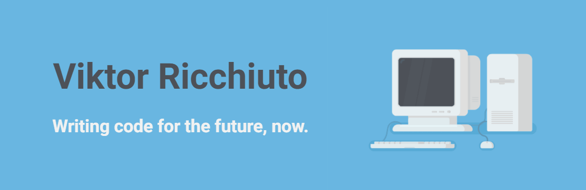

### Hey, I'm Viktor 

#### Full stack developer from Italy

💻 Excited about all things **Javascript**

💯 Advocate of **readable and maintainable code**

🕹 Creating **games** makes me happy

### My Toolbox 🧰

  
  
  
  
  
     
  
  
  
  
  
  
  
  
  

Softwares

   
  
  
  
   
   

---

### Latest projects

### 🎓 [Full-Stuck](https://github.com/cw-thesis-project/full-stuck.com)

Full-stack **serverless application**. Enroll in our coding bootcamp, play minigames to learn new technologies.

Track your progress and unlock the CEO status!

**Tech stack**: Typescript | React | Redux | Sass | GSAP | Auth0 | AWS | MongoDB

> [Live site](http://full-stuck.com) • [Repository](https://github.com/cw-thesis-project/full-stuck.com) • [Demo video](https://www.youtube.com/watch?v=RHwkrV2tcAw)

---

### ⌨ [Tàipo](https://github.com/vikvikvr/taipo)

Multiplayer **typing game**.

Get a sentence, type it as fast as you can.

Beware of the typos, letters can be replaced randomly!

Play alone, challenge random opponents or your own friends.

**Tech stack**: Typescript | React | Rxjs | Sass | GSAP | Howler.js | Express | Socket.io | Firebase

> [Live site](https://play-taipo.netlify.app/) • [Repository](https://github.com/vikvikvr/taipo) • [Demo video](https://www.youtube.com/watch?v=xHpyR43vOwg)

---

### ♿ [Handi-Crawl](https://github.com/vikvikvr/HandiCrawl)

**Mobile app** to help people with physical impairments.

Users can track architectural barriers of public places.

Open the map, add markers and let others know something is wrong there.

**Tech Stack**: React Native | Expo | Firebase | Jest.

> [Repository](https://github.com/vikvikvr/HandiCrawl) • [Demo video](https://www.youtube.com/watch?v=5iPP18p-RU8)

---

### 🚀 [Asteroids](https://github.com/vikvikvr/asteroids)

Classic **arcade game** with a twist.

Fly your spaceship and destroy asteroids.

Everything stops while frozen.

Mayhem happens randomly.

**Tech Stack**: Typescript | React | p5.js

> [Live site](https://asteroids-client.netlify.app/) • [Repository](https://github.com/vikvikvr/asteroids)

---

### Let's chat! 💬

👉 [E-mail](mailto:ricchiuto.viktor@gmail.com)

👉 [LinkedIn](https://www.linkedin.com/in/vikvikvr/)

