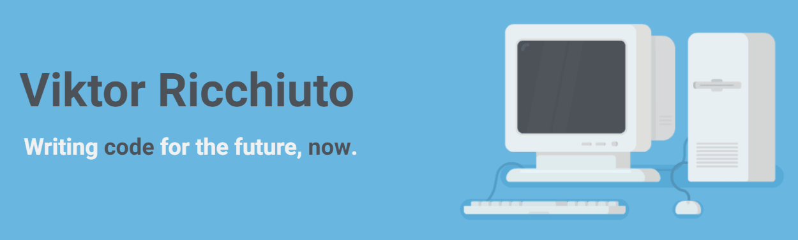

## About me 

I'm **Viktor**, Full Stack Developer from Italy.

💻 Excited about all things **Javascript**

💯 Advocate of **readable and maintainable code**

🎯 **Doing things right** even when nobody's watching

🕹 Creating **games** makes me happy

🤭 **Stand-up comedy** makes me even happier

---

## My Toolbox 🧰

Here are some **technologies** I've built projects with:

Front end

     
  

    
    
      
      
       
      
    
    
    
      
    
       
    
        
      
    
    
  

Back end

   
  
  
  
    
  
  
  
    
  
  
  

Softwares

     
  
  
  
  
   
   
   
    
      

Also worked with

   
  
  
  
  
  

---

## Latest projects 🆕

### 🎓 [Full-Stuck](https://github.com/cw-thesis-project/full-stuck.com)

Full Stack **serverless application**: become a coding bootcamp student, play minigames, learn new technologies, become CEO!

**Tech stack**: Typescript | React | Redux | Sass | GSAP | Auth0 | AWS | MongoDB

> [🌐 Website](http://full-stuck.com) • [📁 Repository](https://github.com/cw-thesis-project/full-stuck.com) • [🎬 Demo video](https://www.youtube.com/watch?v=RHwkrV2tcAw)

---

### ⌨ [Tàipo](https://github.com/vikvikvr/taipo)

Full Stack multiplayer **typing game** that rewards speed and reflexes: watch out for the typos!

**Tech stack**: Typescript | React | Rxjs | Sass | GSAP | Howler.js | Express | Socket.io | Firebase

> [🌐 Website](https://play-taipo.netlify.app/) • [📁 Repository](https://github.com/vikvikvr/taipo) • [🎬 Demo video](https://www.youtube.com/watch?v=xHpyR43vOwg)

---

### ♿ [Handi-Crawl](https://github.com/vikvikvr/HandiCrawl)

**Mobile app** that helps people with physical impairments track architectural barriers of public places.

**Tech Stack**: React Native | Expo | Firebase | Jest.

> [📁 Repository](https://github.com/vikvikvr/HandiCrawl) • [🎬 Demo video](https://www.youtube.com/watch?v=5iPP18p-RU8)

---

### 🚀 [Asteroids](https://github.com/vikvikvr/asteroids)

Classic **arcade game** with a twist: fly in space and survive the asteroids field.

**Tech Stack**: Typescript | React | p5.js

> [🌐 Website](https://asteroids-client.netlify.app/) • [📁 Repository](https://github.com/vikvikvr/asteroids)

---

## Let's chat 💬

Don't be afraid to reach out!

<!--  

---

-->

